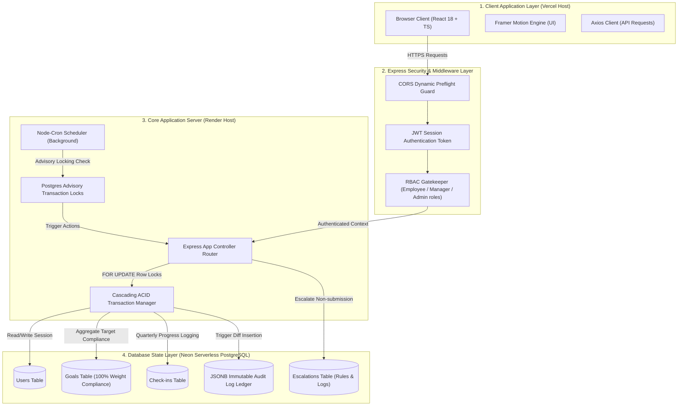

# 📐 AtomQuest Architecture & System Design

This document details the multi-tiered enterprise architecture, relational schemas, database lock management patterns, and audit design principles of the **AtomQuest** portal.

---

## 🗺️ High-Level System Architecture Diagram

Below is the complete architectural layout of AtomQuest, illustrating how client interactions, secure routes, transaction management layers, and database row-locking systems interact.



---

## 🔒 Deep-Dive System Design Paradigms

### 🛡️ **1. Cascading Row Locks (`FOR UPDATE`)**
To prevent race conditions during concurrently executed quarterly goal updates (e.g. employee saving a draft while a manager initiates an approval/lock):
- Every goal update transaction uses a strict `SELECT ... FOR UPDATE` row-level lock block.
- This ensures sequential integrity and serializes state transitions without causing full-table lock contention.

### 📜 **2. Immutable Audit Ledger with JSONB Diff**
Instead of bulky and heavy standard history tables:
- A single relational `audit_logs` ledger stores high-fidelity state histories.
- Each state mutation automatically calculates the diff using Postgres' native fast JSONB operators, storing `old_value` and `new_value` parameters. This makes data verification incredibly fast and completely tamper-proof.

### ⏱️ **3. SLA Cron Scheduler & Postgres Advisory Locks**
- Background jobs run at scheduled times using a reliable `node-cron` runtime environment.
- To prevent double-execution when scaling horizontally (multiple server instances processing concurrently):
  - The job obtains a **PostgreSQL Advisory Lock** using `pg_try_advisory_xact_lock(lock_id)`.
  - Only the single instance that successfully secures the lock processes the SLA reminders, guaranteeing zero duplicate alerts.

---

## 🗄️ Database Entity-Relationship Diagram (ERD)

```mermaid
erDiagram
    USERS {
        serial id PK
        varchar name
        varchar email UK
        varchar password_hash
        enum role "employee | manager | admin"
        varchar department
        integer manager_id FK
        timestamp created_at
    }

    GOALS {
        serial id PK
        integer employee_id FK
        varchar thrust_area
        varchar title
        text description
        varchar uom
        integer target
        timestamp deadline
        integer weightage "Must sum to 100 per cycle"
        varchar status "draft | pending_approval | approved | locked"
        boolean locked
        integer cycle_year
        timestamp created_at
    }

    CHECK_INS {
        serial id PK
        integer goal_id FK
        varchar quarter "Q1 | Q2 | Q3 | Q4"
        integer actual_value
        timestamp completion_date
        varchar progress_status
        decimal score
        timestamp created_at
    }

    AUDIT_LOGS {
        serial id PK
        varchar action
        jsonb old_value
        jsonb new_value
        integer user_id FK
        integer goal_id FK
        timestamp created_at
    }

    ESCALATION_RULES {
        serial id PK
        varchar name
        varchar trigger_type "goal_not_submitted | approval_pending | checkin_overdue"
        integer threshold_days
        varchar action
        boolean is_active
        integer created_by FK
        timestamp created_at
    }

    ESCALATION_LOGS {
        serial id PK
        integer rule_id FK
        integer employee_id FK
        integer manager_id FK
        text message
        boolean resolved
        timestamp created_at
    }

    USERS ||--o{ USERS : "manages"
    USERS ||--o{ GOALS : "owns"
    GOALS ||--o{ CHECK_INS : "tracks"
    USERS ||--o{ AUDIT_LOGS : "performs"
    GOALS ||--o{ AUDIT_LOGS : "mutates"
    USERS ||--o{ ESCALATION_RULES : "defines"
    ESCALATION_RULES ||--o{ ESCALATION_LOGS : "triggers"
    USERS ||--o{ ESCALATION_LOGS : "escalates"
